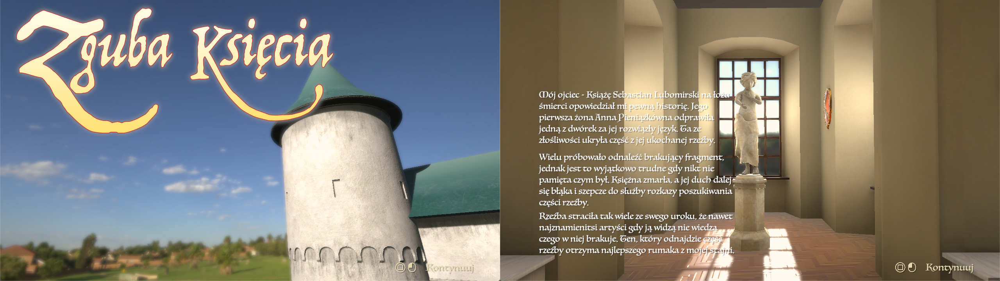
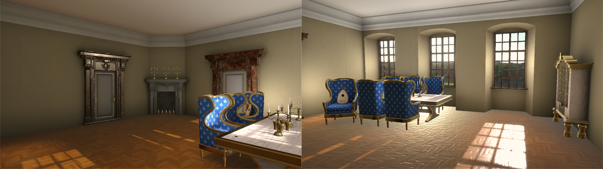
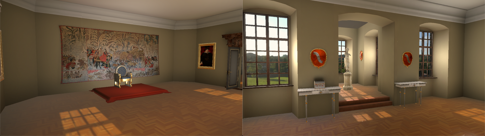

# Sala Audiencyjna - Zguba Księcia

Gra "Zguba Księcia" dziejąca się w pomieszczeniach opartych o zamek Stary Wiśnicz. Powstała w ramach projektu na studiach. Została napisana w środowisku Unity.

## Założenia projektu

Gra przedstawiająca wnętrze zamku, do którego dodano modele, bazując na istniejących obiektach, znajdujacych się w samym zamku lub w innych miejscach. Poza eksploracją pomieszczeń, gracz ma za zadanie odnaleźć brakujący element pomniku w głównej sali. 

## Cechy

* Odwzorowanie pomieszczeń zamku
* Zagadki związane z otoczeniem

## Zawartość repozytorium

* Skrypty
* Modele oraz grafika
* Pliki muzyczne
